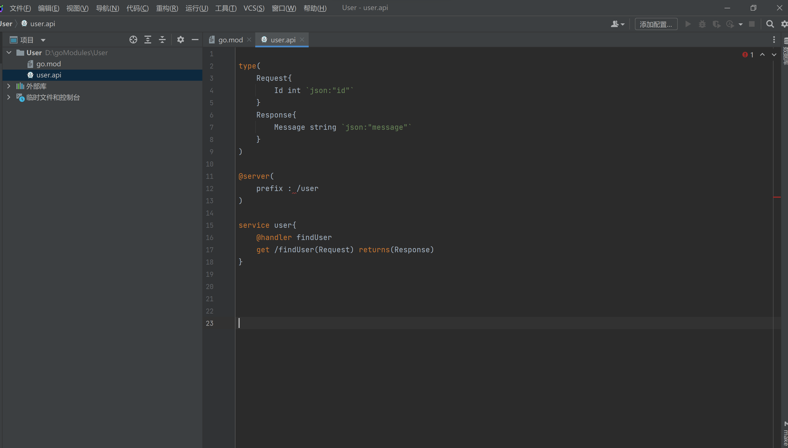
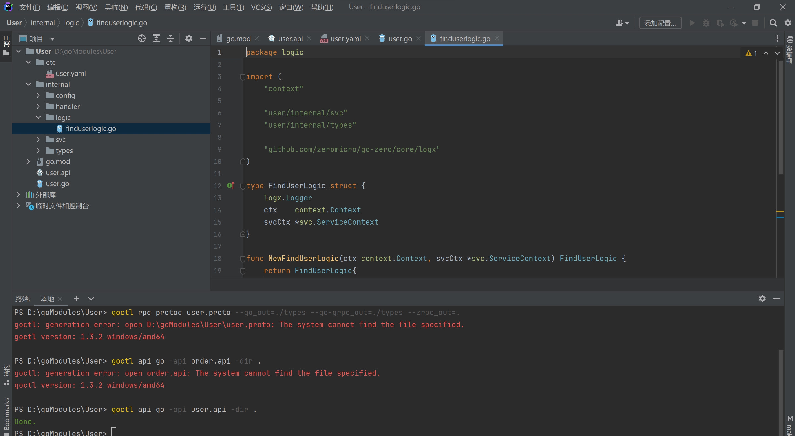
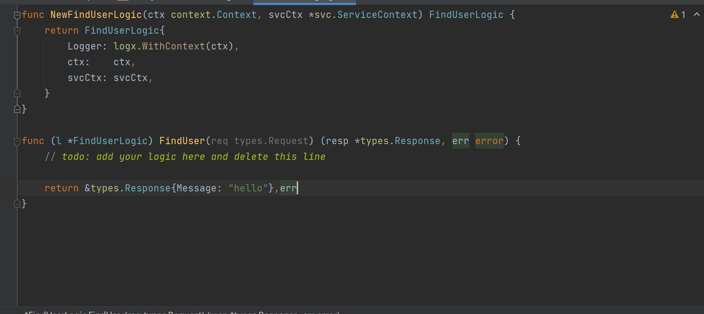
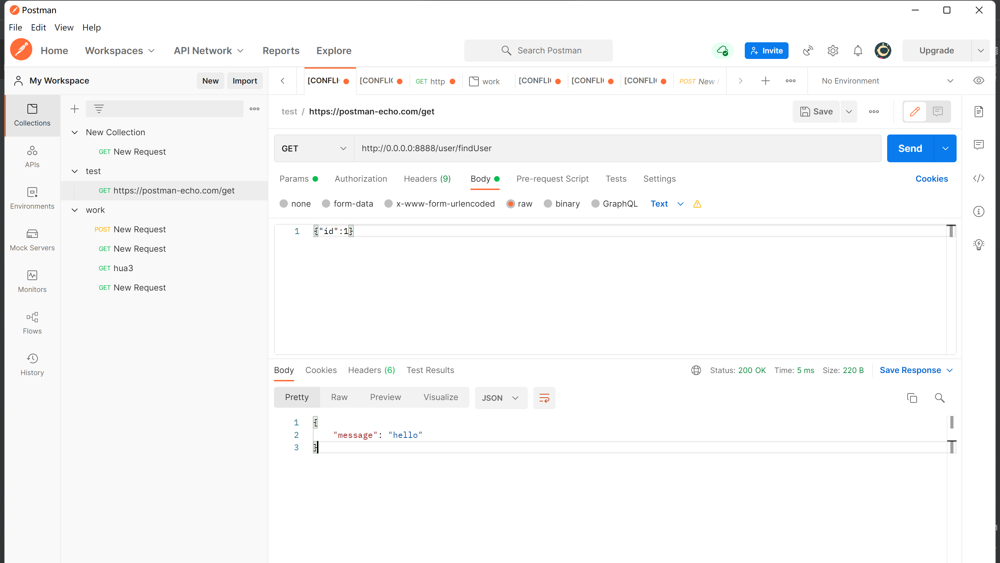

# go-zero api开发流程即注意事项

# 官方文档

[go-zero.dev](https://go-zero.dev/cn/)

## 环境安装

- 需要安装etcd环境,protoc，goctl
``` bash
    # 下载安装protoc-gen-go
    $ go install google.golang.org/protobuf/cmd/protoc-gen-go@v1.26
    $ go install google.golang.org/grpc/cmd/protoc-gen-go-grpc@v1.1
```

## 开发流程

**不建议现阶段直接使用idea goctl插件自动new目录插件创建项目，版本兼容问题较多 请等待官方更新 2022/2/24**

---
### 目前最佳实践
### 1. 使用goland新建项目
### 2. 优先编写api文件 命名[$项目名].api
### 3. 编写api文件 
``` go
/**
 * api语法示例及语法说明
 */

// api语法版本 可选
syntax = "v1"

// import literal 可选
import "foo.api" 

// import group
import (
    "bar.api"
    "foo/bar.api"
)
info(
    author: "songmeizi"
    date:   "2020-01-08"
    desc:   "api语法示例及语法说明"
)

// type literal

type Foo{
    Foo int `json:"foo"`
}

// type group 可以定义多个struct

type(
    Bar{
        Bar int `json:"bar"`
    }
)

type UserInfo {
	TeacherRes  TeacherResponse        `json:"teacherRes"` //需要写json标签才不会报错
	Id          int32                  `json:"id"`
	TeacherInfo TeacherInfoForRegister `json:"teacherinfo"`
}

// service block
@server(
    jwt:   Auth
    group: foo
    prefix: /api //声明前缀
)

// 声明服务名 与之后生成的yaml文件名挂钩
service foo-api{
    @doc "foo" 
    @handler foo //声明路由可以写多个
    post /foo (Foo) returns (Bar) //声明请求方式与地址
}
```

*prefix爆红不影响*


### 4. 使用插件创建命令如下
``` bash
# api创建指令 如需更新也使用这条指令 
goctl api go -api [api名字] -dir .
```
### 5. 创建完成 在logic文件夹下写业务代码


---


### 6 运行程序


``` bash
go run .\teacher.go -f .\etc\template.yaml
# 或者直接build
```


### 7. 完毕即可使用postman测试 rpc调用在另一篇文档




> - 注意请求方式
> - 要在Header中添加Content-Type:application/json


