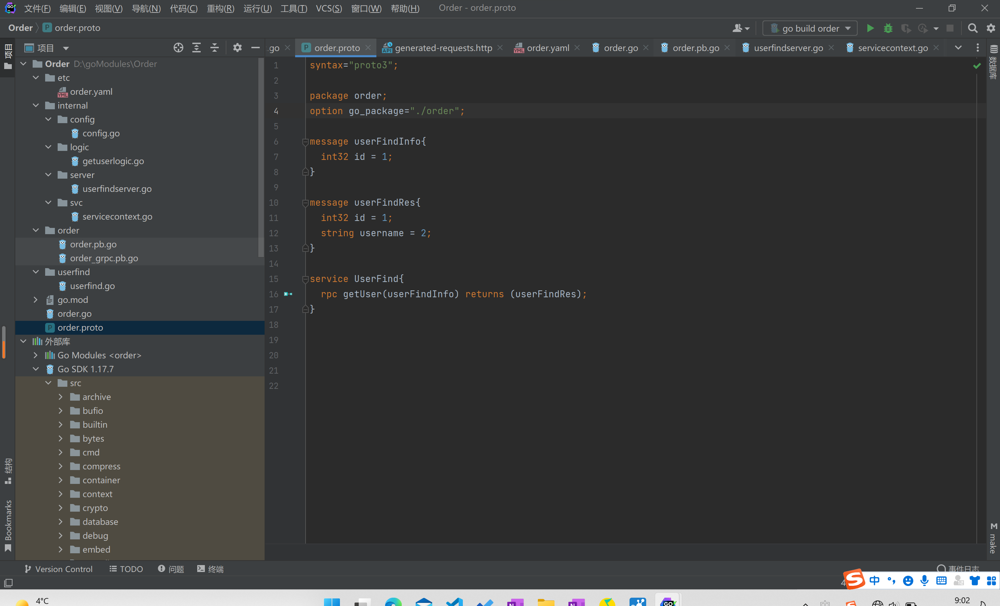
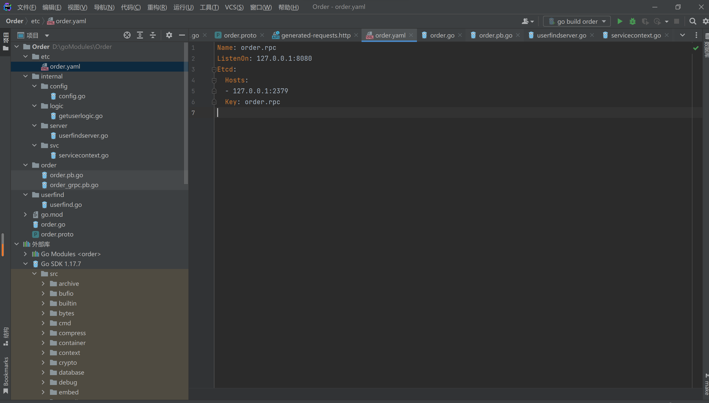
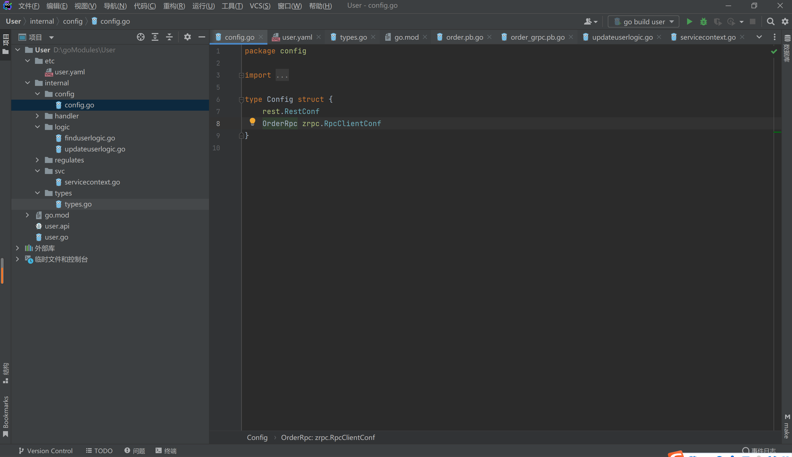
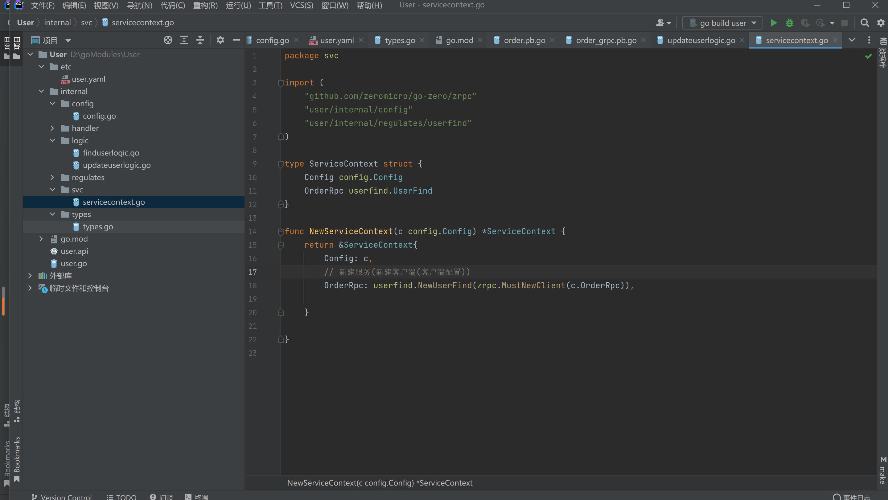
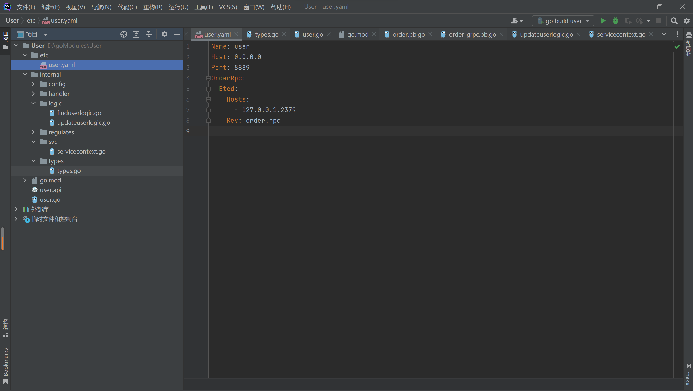
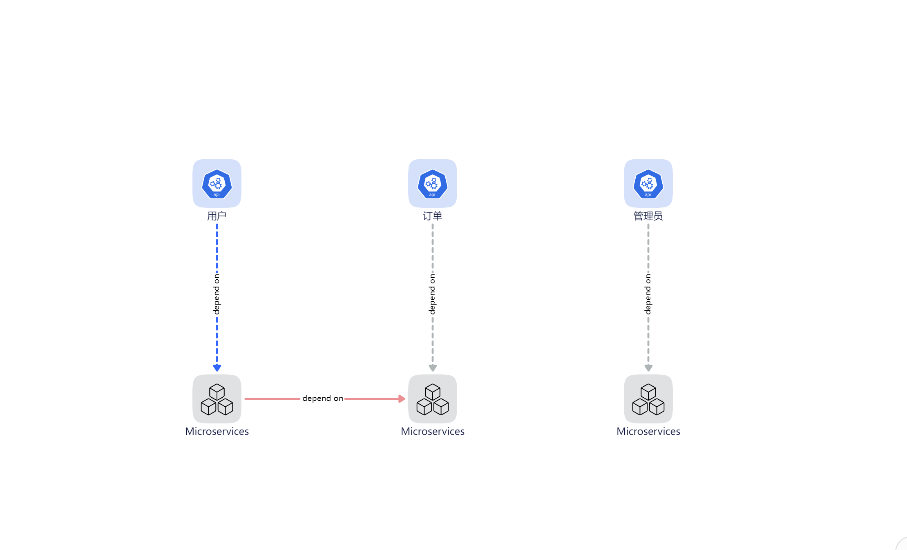

# rpc开发流程即注意事项

# 官方文档

[go-zero.dev](https://go-zero.dev/cn/)

## 环境安装

- 需要安装etcd环境,protoc,goctl 
``` bash
    # 下载安装protoc-gen-go
    $ go install google.golang.org/protobuf/cmd/protoc-gen-go@v1.26
    $ go install google.golang.org/grpc/cmd/protoc-gen-go-grpc@v1.1
```

## 开发流程
**不建议现阶段直接使用idea goctl插件自动new目录插件创建项目，版本兼容问题较多 请等待官方更新 2022/2/24**


### 1. goland新建项目 编写protoc文件

``` go
syntax = "proto3";

package remote; 

//  '/'一定要加 与package名字相同
option go_package = "./remote";

message Request {
  // 用户名
  string username = 1;
  // 用户密码
  string password = 2;
}

message Response {
  // 用户名称
  string name = 1;
  // 用户性别
  string gender = 2;
}

//service 只能写一个 可以在里面定义多个方法
service User {
  // 登录 tes
  rpc Login(Request)returns(Response);
}
```

``` bash
# gpc创建指令 如需更新也使用这条指令
$ goctl rpc protoc [$文件名].proto --go_out=. --go-grpc_out=. --zrpc_out=.
```

### 2. **proto文件**
   
   *注意service名*
   
   *生成的yaml文件 可以看到自动将rpc服务注册到了etcd中，且端口为2379 且此时自动生成了[$service名]的文件夹,当我们为客户端添加rpc服务时，导入此文件夹*

### 3. **在logic文件夹中编写rpc逻辑**


### 4. **转到客户端（api或其它RPC），在config文件夹中添加rpc配置 名称与客户端一致(如客户端yaml的key为order.rpc 我们就命名为OrderRpc 此后该名称就作为服务端标志符 要求一致) ，OrderRpc 之后会写在yaml文件上**
   

### 5. **转到客户端，在svc文件夹中注册rpc服务** 
   
   *注意这里导入了服务名的包并取名为OrderRpc(与之后yaml文件对接),在下面初始化了其方法*

> 这里导入的是rpc生成的，proto文件里service名生成的文件里的接口
>
> 总结: 
>
> * config里写客户 (调用zrpc的RpcClientConf)
>
> * service上写接口(声明接口)
>
> * service下写方法(调用New...(zrpc.MustNewClient) )

### 6.  **更新客户端的yaml文件**
   
   *注意此时端口号和etcd配置，与服务端对接即可*

```yaml
Name: courseApi
Host: 0.0.0.0
Port: 8890
CourseRpc:
  Etcd:
    Hosts:
      - 127.0.0.1:2379
    Key: courserpc.rpc
```


### 7.**api逻辑编写调用rpc服务**


## 服务启动顺序

> 微服务的服务启动顺序也是一个学问，因此我们需要对于系统架构有一个总体认识 一般来说api层不会优先启动，因为api层都会依赖于注册的etcd服务，在rpc层中，则优先启动没有被依赖的独立的服务。

> 以上图为例，用户和订单中，应优先启动订单的微服务，再依次启动用户的微服务，最后再启动api层。
> 在本例中，因为管理员未和其它产生依赖，所以只需先启动微服务再启动api。


## 总结
**综上所述，微服务主要难在业务粒度的划分与部署和管理，因此在实际开发过程中，开发者同样也需要对项目整体结构具有一定了解，而不是使用微服务就意味着画地为牢，只关心自己的业务。**


